# アーキテクチャ設計

## サマリ

このドキュメントでは、全体構成（3層構成）、依存方向（4レイヤー）、境界（クライアント/サーバーのモジュール分割・責務・CRDT型定義）、データフロー（オフライン編集・CRDT同期・認証・インポート/エクスポート）、同期状態モデル（5状態遷移）、PWAキャッシュ戦略を定める。DBはCRDTスナップショット中心、APIはSyncHandler一本化。OpenAPIによるスキーマ駆動開発を採用。

## 変更履歴

| 日付 | 内容 | 意図 |
| --- | --- | --- |
| 20260113 | 初版作成 | - |
| 20260113 | モノレポ構成追記 | pnpm workspaces、ディレクトリ構成を明確化 |

## 本文

### 技術スタック

| レイヤー | 技術 | バージョン |
| --- | --- | --- |
| パッケージ管理 | pnpm workspaces | - |
| フロントエンド | Next.js (App Router) | 15 |
| フロントエンド | React | 19 |
| バックエンド | Hono | - |
| バックエンド | Cloudflare Workers | - |
| データベース | PostgreSQL (Neon) | - |
| 言語 | TypeScript | 5.x |

### 全体構成

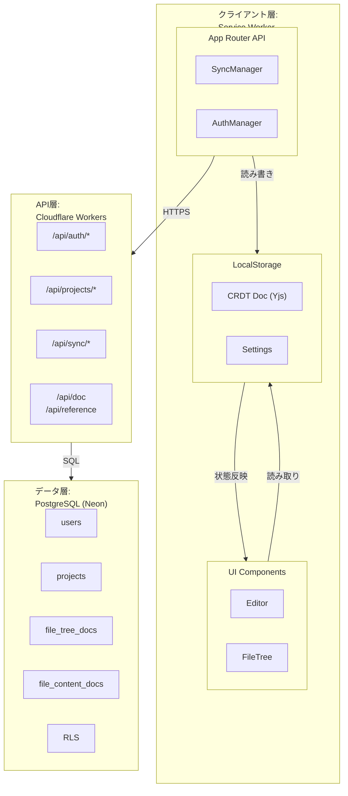

### 依存方向

#### レイヤー構成

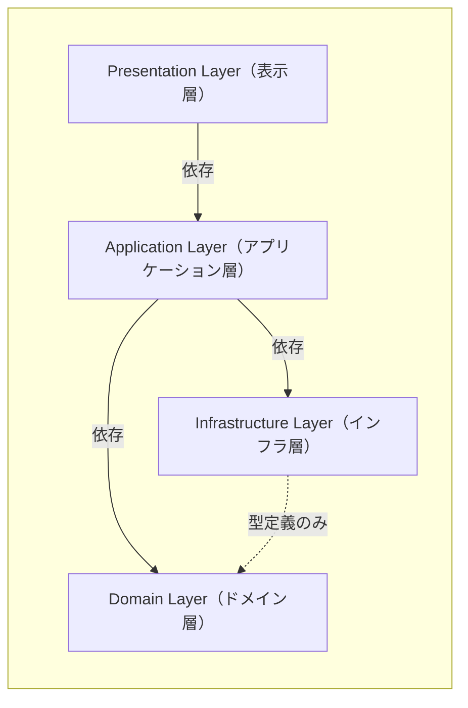

#### レイヤー責務

- **Presentation**
  - 責務: UIの描画、ユーザーイベントの受付

- **Application**
  - 責務: ユースケースの実行、状態管理、エラーハンドリング

- **Domain**
  - 責務: ビジネスルール、エンティティ定義、バリデーション

- **Infrastructure**
  - 責務: 外部サービス通信、永続化

#### 依存ルール

- 上位レイヤーは下位レイヤーに依存する（単方向）
- Domain層は他のレイヤーに依存しない（純粋なビジネスロジック）
- Infrastructure層はDomain層の型定義のみを参照（実装には依存しない）

### 境界

#### モノレポ構成

pnpm workspacesによるモノレポ構成を採用。

```
/
├── apps/
│   ├── frontend/
│   │   └── web/                 # Next.js 15 (App Router)
│   └── backend/                 # Cloudflare Workers (Hono)
├── packages/
│   └── shared/                  # 共有パッケージ（型定義、バリデーション等）
├── pnpm-workspace.yaml
└── tsconfig.base.json           # 共通TypeScript設定
```

#### フロントエンド（apps/frontend/web）

```
src/
├── components/          # Presentation Layer
│   ├── editor/          # エディタ関連コンポーネント
│   ├── file-tree/       # ファイルツリー関連コンポーネント
│   ├── project/         # プロジェクト関連コンポーネント
│   ├── auth/            # 認証関連コンポーネント
│   ├── sync/            # 同期状態表示コンポーネント
│   └── common/          # 共通UIコンポーネント
│
├── features/            # Application Layer（機能単位）
│   ├── editor/          # エディタ機能
│   │   ├── hooks/
│   │   └── context/
│   ├── file-tree/       # ファイルツリー機能
│   ├── project/         # プロジェクト管理機能
│   ├── auth/            # 認証機能
│   ├── sync/            # 同期機能
│   └── settings/        # 設定機能
│
├── infrastructure/      # Infrastructure Layer
│   ├── api/             # REST API クライアント
│   └── storage/         # ローカルストレージ
│       └── crdt-doc.ts
│
└── lib/                 # 共通ユーティリティ
    ├── constants/
    └── utils/
```

#### バックエンドAPI（apps/backend）

```
src/
├── routes/              # ルートハンドラー
│   ├── auth.ts          # 認証ルート
│   ├── projects.ts      # プロジェクトルート
│   └── sync.ts          # 同期ルート
├── middleware/          # ミドルウェア
│   ├── auth.ts          # JWT検証、RLS設定
│   └── error.ts         # エラーハンドリング
├── db/                  # データベース
│   ├── schema.ts        # Drizzle ORMスキーマ定義
│   └── client.ts        # DBクライアント
└── index.ts             # エントリーポイント、OpenAPI設定
```

#### 共有パッケージ（packages/shared）

```
src/
├── schemas/             # Zodスキーマ定義（バリデーション・型生成）
│   ├── auth.ts          # 認証関連
│   ├── project.ts       # プロジェクト関連
│   ├── sync.ts          # 同期関連
│   ├── settings.ts      # 設定関連
│   └── common.ts        # 共通スキーマ（UUID、日時、レスポンス等）
├── types/               # 型定義
│   ├── entities.ts      # エンティティ型（Zodスキーマから生成）
│   ├── api.ts           # APIリクエスト/レスポンス型
│   └── errors.ts        # エラーコード定義
├── storage/             # ローカルストレージ
│   └── keys.ts          # ストレージキー定数
├── config/              # 設定
│   └── env.ts           # 環境設定
└── test/                # テストユーティリティ
    └── factories.ts     # テストファクトリ
```

#### モジュール間の入出力

```typescript
// 概要: UIが参照するファイルツリー構造のCRDT（プロジェクトごとに1つ）
// 責務: ファイルやフォルダの作成・削除・移動・改名を記録
type FileTreeDoc = {
  projectId: string             // プロジェクトID（UUID）
  doc: Uint8Array               // Yjsドキュメントのスナップショット
  updatedAt: number             // 最終更新時刻（ms）
}

// 概要: UIが参照するファイル内容のCRDT（ファイルごとに1つ）
// 責務: ファイル内容の変更を記録
type FileContentDoc = {
  fileId: string                // ファイルID（UUID）
  doc: Uint8Array               // Yjsドキュメントのスナップショット
  updatedAt: number             // 最終更新時刻（ms）
}

// 概要: サーバーと双方向通信を行うための差分（共通）
// 責務: 同期用に差分のみを保持(具体的なマージ処理は外部サービスに委譲)
type CRDTUpdate = {
  targetId: string              // 対象ID（UUID, projectId | fileId）
  targetType: 'tree' | 'content'
  update: Uint8Array            // Yjs update
  clientId: string              // 送信元クライアントID
  createdAt: number             // 生成時刻（ms）
}
```

#### サーバー毎の責務

- **Frontend (Next.js / Vercel)**
  - 責務: SSR/SSG、静的アセット配信、PWA、APIプロキシ
  - プロキシ: Next.js Rewritesで `/api/*` をバックエンドへ転送（同一オリジン構成）

- **Backend API (Cloudflare Workers)**
  - 責務: REST API、認証、同期処理、OpenAPIドキュメント生成
  - 公開: 内部のみ（フロントエンド経由でアクセス）

- **Database (Neon)**
  - 責務: データ永続化、RLS

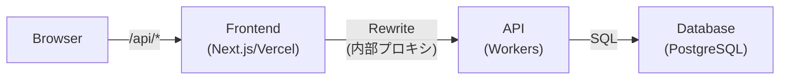

#### 同一オリジン構成

ブラウザから見えるAPIエンドポイントは常に同一オリジン（`/api/*`）となる。Next.js Rewritesにより、リクエストはCloudflare Workersへ内部プロキシされる。

| 環境 | フロントエンドURL | APIエンドポイント | プロキシ先 |
|------|------------------|------------------|-----------|
| 本番 | `https://{domain}` | `/api/*` | Cloudflare Workers |
| ステージング | `https://staging.{domain}` | `/api/*` | Cloudflare Workers |
| 開発 | `http://localhost:3000` | `/api/*` | `http://localhost:8787` |

- Cookie認証で `SameSite=Strict` を安全に使用可能
- CORS設定が不要
- ブラウザから見てシンプルなAPI構成

#### CRDT同期の責務

- **クライアント（SyncManager）**
  - 処理: ローカルのCRDT更新を収集し、APIへ送信
  - 受信: サーバーから受け取ったCRDT更新を適用
  - 結果: CRDTの特性により自動マージされる

- **API（SyncHandler）**
  - 処理: 受信したCRDT更新を保存し、他クライアント向けに配信
  - 保管: DBにCRDT更新またはスナップショットを保存

#### リトライ制御の責務

- **クライアント（SyncManager）**
  - リトライ判定: HTTPステータス 5xx または ネットワークエラー時
  - リトライ間隔: 指数バックオフ（1秒 → 2秒 → 4秒）
  - 最大リトライ: 3回
  - 3回失敗後: 未送信更新をローカルに保持

- **API（SyncHandler）**
  - リトライ不要の判定: 4xx エラー（バリデーションエラー、認証エラー等）
  - レスポンス: `retryable: false` フラグを返却

#### CRDTドキュメントの永続化

- **保存タイミング**
  - ドキュメント更新時に定期スナップショット保存

- **容量制限・超過時の挙動**
  - 要件定義書を参照

#### 主要コンポーネントの責務

##### フロントエンド側

- **Editor**
  - 責務: マークダウン編集UI
  - 入力: ファイルコンテンツ
  - 出力: 編集イベント

- **FileTree**
  - 責務: ファイル・フォルダ階層表示
  - 入力: ツリーデータ
  - 出力: 選択・操作イベント

- **SyncManager**
  - 責務: CRDT更新の送受信・同期状態管理
  - 入力: 操作イベント
  - 出力: 同期状態

- **AuthManager**
  - 責務: 認証状態管理
  - 入力: 認証情報
  - 出力: セッション状態

- **ExportManager**
  - 責務: ZIPエクスポート（クライアント側で完結）
  - 処理: ローカルCRDTからファイル内容取得 → ZIP生成 → ダウンロード
  - 備考: サーバー通信不要（オフライン対応）

- **ImportManager**
  - 責務: フォルダインポート（クライアント側で完結）
  - 処理: フォルダ選択 → 検証 → FileTreeDoc/FileContentDoc更新
  - 備考: 失敗時はロールバック、サーバー通信不要（オフライン対応、同期は後で自動実行）

##### バックエンド側

- **AuthHandler**
  - 責務: 認証・認可処理
  - エンドポイント: `/api/auth/*`

- **ProjectHandler**
  - 責務: プロジェクトCRUD
  - エンドポイント: `/api/projects/*`

- **SyncHandler**
  - 責務: CRDT同期処理（ファイル/ツリー操作含む）
  - エンドポイント: `/api/sync/*`

- **OpenAPIMiddleware**
  - 責務: OpenAPI仕様書・API Reference UIの提供（開発環境のみ）
  - エンドポイント: `/api/doc`, `/api/reference`

### データフロー

#### オフライン編集フロー

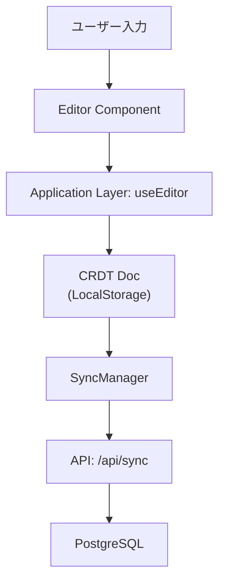

- CRDTスナップショット（編集内容）はlocalStorageに保存されているため、リロード後も復元される
- 操作ログ（undo/redo履歴）はメモリ上のみのため、リロードで消滅する
- オンライン復帰時、localStorageのスナップショットを元にサーバーと差分同期を行う

#### CRDT同期フロー

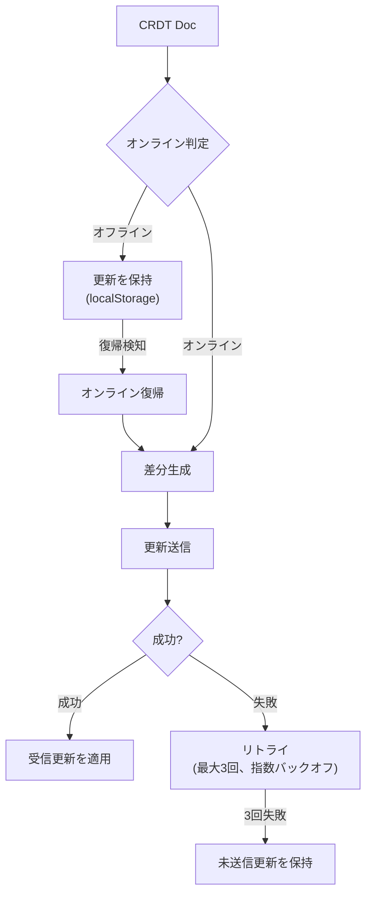

#### 認証フロー

##### ログイン（サインアップ含む）

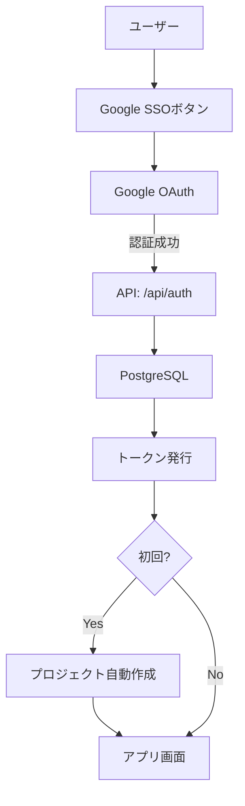

##### ログアウト

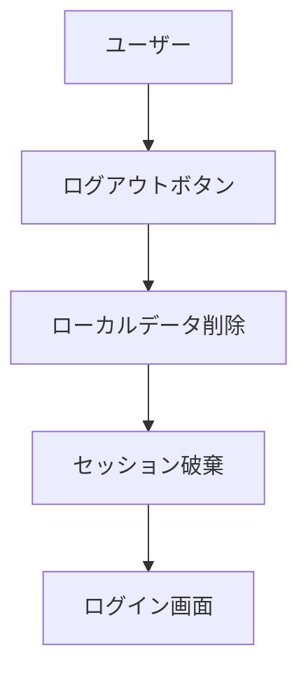

##### トークン失効（強制ログアウト）

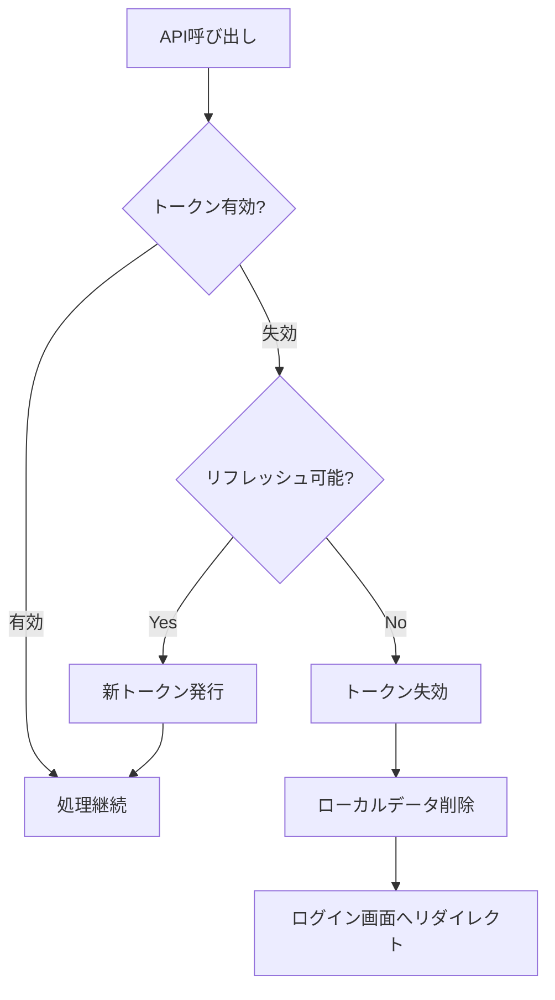

#### インポート/エクスポートフロー

##### ZIPエクスポート（オフライン対応）

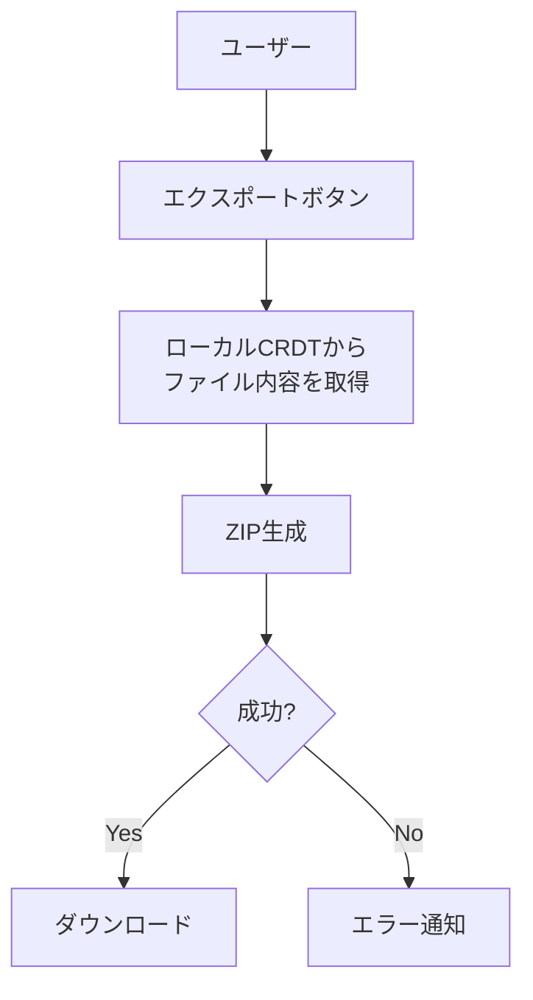

##### フォルダインポート（オフライン対応）

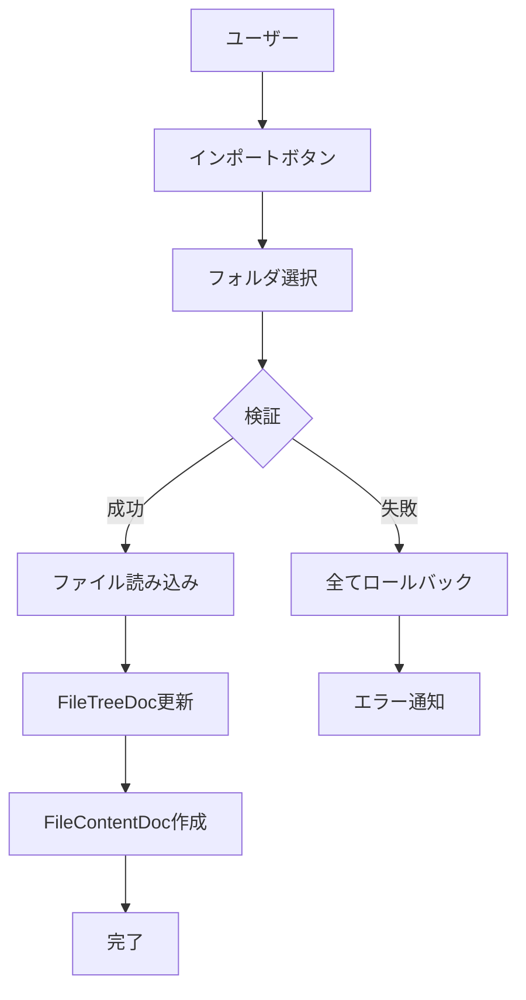

### 同期状態モデル

#### 状態遷移図

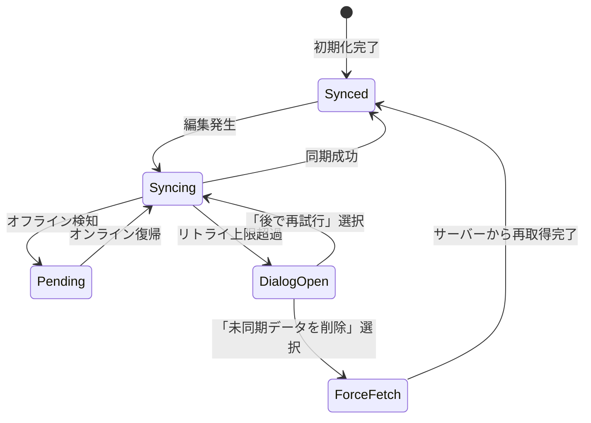

#### 状態定義

| 状態 | 説明 | 条件 |
| --- | --- | --- |
| Synced | 全データ同期済み | `pendingUpdateCount === 0 && retryExhausted === false` |
| Syncing | 同期処理中 | `pendingUpdateCount > 0 && retryExhausted === false` |
| Pending | オフラインで同期待ち | `isOnline === false && pendingUpdateCount > 0` |
| DialogOpen | リトライ上限超過でダイアログ表示中 | `retryExhausted === true` |
| ForceFetch | サーバーからの強制再取得中 | ユーザーが「未同期データを削除」を選択 |

※UI表示については`画面設計.md`を参照

#### 状態管理インターフェース

```typescript
type SyncState = {
  status: 'synced' | 'syncing' | 'pending' | 'dialog_open' | 'force_fetch'
  pendingUpdateCount: number    // 未送信更新件数
  retryExhausted: boolean       // リトライ上限超過フラグ
  isOnline: boolean             // オンライン状態
  lastSyncedAt: number | null   // 最終同期成功時刻（ms）
}

type SyncAction =
  | { type: 'EDIT', update: CRDTUpdate }
  | { type: 'SYNC_START' }
  | { type: 'SYNC_SUCCESS', updateId: string }
  | { type: 'SYNC_FAILURE', updateId: string }
  | { type: 'RETRY_EXHAUSTED' }
  | { type: 'ONLINE' }
  | { type: 'OFFLINE' }
  | { type: 'DIALOG_RETRY' }
  | { type: 'DIALOG_DISCARD' }
  | { type: 'FORCE_FETCH_COMPLETE' }
```

### PWAキャッシュ戦略

#### キャッシュ対象と戦略

- **静的アセット（JS/CSS/画像）**
  - 戦略: Cache First
  - 実装: Service Workerのinstallイベントでプリキャッシュ
  - 更新: ビルドごとにキャッシュ名にハッシュを付与、古いキャッシュは削除
- **HTMLシェル**
  - 戦略: Network First（フォールバック: キャッシュ）
  - 理由: 最新のHTMLを優先しつつ、オフライン時も起動可能に
- **APIレスポンス**
  - 戦略: Network Only（キャッシュしない）
  - 理由: データはローカルストレージで管理、APIキャッシュは二重管理になる
- **フォント**
  - 戦略: Cache First
  - 有効期限: 1年（変更頻度が低い）
