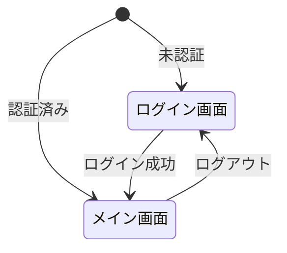

# 画面設計

## サマリ

このドキュメントでは、画面一覧（ログイン/メイン）、画面遷移、共通仕様（ダイアログ/キーボード操作）、各画面のレイアウト・状態・動作、主要UIコンポーネント（サイドパネル/ファイル機能/設定機能/エディター/通知）、例外/空状態、デザイン要件を定める。デザイン仕様はプロダクトデザイン書を参照。

## 変更履歴

| 日付 | 内容 | 意図 |
| --- | --- | --- |
| 20260113 | 初版作成 | - |

## 本文

### 画面一覧

| 画面ID | 画面名 | 説明 |
| --- | --- | --- |
| SC-01 | ログイン画面 | 認証ボタン（本番: Google OAuth / 開発: ワンクリック認証） |
| SC-02 | メイン画面 | エディター + サイドパネル |

### 画面遷移図



### 共通仕様

#### ダイアログ

モーダル、トースト、ポップオーバーなどのダイアログ表示時の共通仕様。

| 項目 | 仕様 |
| --- | --- |
| 背景 | ぼかし（すりガラス効果） |
| 範囲外操作 | スクロール・入力不可 |

#### キーボード操作

**フォーカス管理**

- モーダル/ポップオーバー表示時、フォーカスをその中に閉じ込める（フォーカストラップ）
- モーダル/ポップオーバー閉じ時、元のトリガー要素にフォーカスを戻す

**共通キーボード操作**

初期はRedo/Undoと、CodeMirrorの既定ショートカットコマンドのみ許可する。ボタンやインプットなどでのEnter確定やEscキャンセルなどは禁止。

| キー | 動作 |
|------|------|
| `Ctrl/Cmd + Z` | 操作を元に戻す（Undo）※YjsのUndoManager使用 |
| `Ctrl/Cmd + Shift + Z` | 操作をやり直す（Redo）※YjsのUndoManager使用 |
| `CodeMirrorコマンド` | エディターへの入力時のみ有効、動作はCodeMirror既定の通り |

**ファイルツリーのキーボード操作**

基本的にファイルツリーはクリック/タップのみで操作可能とし、キーボードでの操作は禁止する。ただし、共通キーボード操作は例外とする。

### 各画面の詳細仕様

#### SC-01: ログイン画面

**目的**

- ユーザー認証

**レイアウト**

- 本番: `Googleログインボタンを中央配置`
- 開発: `開発ログインボタンを中央配置`

#### SC-02: メイン画面

**目的**

- マークダウン編集

**レイアウト（パネル非表示時）**

```
右上: 同期状態アイコン(✓など) + ハンバーガーメニュー(Ⲷ)
┌────────────────────────────────────────────────────┐
│                                                ✓ Ⲷ │
│                                                    │
│                                                    │
│                 Editor (Full Screen)               │
│                                                    │
│                                                    │
│                                                    │
└────────────────────────────────────────────────────┘
```

**レイアウト（パネル表示時）**

```
┌─────────────────────────────────┬───────────────────┐
│                                 │ 📁 ⚙️ 📋 🤖        │
│                                 ├───────────────────┤
│                                 │                   │
│   Bulr Background (Disabled)    │                   │
│                                 │   View Container  │
│                                 │                   │
│                                 │                   │
└─────────────────────────────────┴───────────────────┘
```

**状態**

| 状態 | エディター | パネル | ハンバーガー |
| --- | --- | --- | --- |
| 編集中 | アクティブ | 非表示 | 表示 |
| パネル表示中 | ぼかし＆入力不可 | 表示 | 非表示 |

**パネル開閉動作**

- 開く: ハンバーガーメニューをタップ
- 閉じる: エディター領域に一度タップで入力禁止解除（もう一度タップで入力状態に）
- アニメーション: スライド + フェードアウト（200〜300ms）

### 主要UIコンポーネント責務

#### サイドパネル

**構成**

```
┌──────────────────────────────┐
│ 📁 ⚙️ 📋 🤖                   │ <- Activity Bar
├──────────────────────────────┤
│                              │
│                              │
│        View Container        │
│                              │
│                              │
└──────────────────────────────┘
```

**アクティビティバーの機能**

| アイコン | 機能 | 状態 |
| --- | --- | --- |
| 📁 | ファイル | 実装対象 |
| ⚙️ | 設定 | 実装対象 |
| 📋 | VC（バージョン管理） | 「開発中」表示 |
| 🤖 | エージェント | 「開発中」表示 |

#### ファイル機能

**レイアウト**

```
┌──────────────────────────────┐
│ Test Project ▼               │ <- PJモーダルを表示(作成/削除/名称変更)
│                           +  │ <- ルートへのアクションのPopoverを表示
│  docs/                    ⁝  │ <- 同階層へのアクションのPopoverを表示
│    doc1.md                ⁝  │
│    doc2.md                ⁝  │
│  README.md                ⁝  │
│ ──────────────────────────── │     
│                      　 ⬆️ ⬇️ │ <- インポート/エクスポート
└──────────────────────────────┘
```

**操作**

| 操作 | 方法 |
| --- | --- |
| プロジェクト切り替え | プロジェクト名タップ → モーダル表示 |
| ルート直下に作成 | +ボタン → ポップオーバー表示 |
| ファイル/フォルダ操作 | ⁝ボタン → ポップオーバー表示 |
| ファイル/フォルダ移動 | ドラッグ&ドロップ |
| ファイル選択 | 行タップ → エディターで開く |

**並び順**

- ファイル/フォルダは名前かつ昇順で強制ソート
- 手動での並び替え機能は無し
- 同階層では、フォルダが上、ファイルが下
- ソート比較はロケール対応（`Intl.Collator`で日本語の読み順対応）

**⁝ボタンのポップオーバー**

| 対象 | メニュー項目 |
| --- | --- |
| ファイル | 改名、削除 |
| フォルダ | 改名、削除、ファイル作成 |

**削除時の確認**

- ファイル/フォルダ: 確認ダイアログなしで即削除
- プロジェクト: 確認ダイアログありで削除可能（名前入力を要求）

**ファイル/フォルダ作成時のインライン入力**

- +/⁝ボタンの「ファイル作成」を押すと、該当階層の一番下に入力欄が出現
- 入力欄の右端に ✓ボタン（確定）と ✕ボタン（キャンセル）が表示
- ✓ボタン → 作成確定
- ✕ボタン → キャンセル
- 入力エリア以外を押してもキャンセル拒否（正規のキャンセル手順のみ許可）

```
┌──────────────────────────────┐
│ Test Project ▼               │
│                           +  │
│  docs/                    ⁝  │
│    doc1.md                ⁝  │
│    doc2.md                ⁝  │
│    [input new name]      ✓ ✕ │ ← 階層の一番下に入力欄を表示
│  README.md                ⁝  │
└──────────────────────────────┘
```

**改名時のインライン入力**

- ⁝ボタンから「名称変更」を選ぶと、その行が入力欄に変化
- 元のファイル名/フォルダ名が入力欄に入った状態で表示
- ✓ボタン → 作成確定
- ✕ボタン → キャンセル
- 入力エリア以外を押してもキャンセル拒否（正規のキャンセル手順のみ許可）

#### 設定機能

**レイアウト**

```
┌─────────────────────────────────┐
│                                 │
│  同期　                          │
│  状態    同期済み                 │
│  時刻    １２:３４                │
│  待機    0件                     │    
│  失敗    0件                     │
│                                 │
│ ─────────────────────────────── │
│                                 │
│  表示                          　│
│  フォント　　　BIZUDゴシック　   ▼  │
│  行折り返し　　オン　　　　　　   ▼  │
│  テーマ　　　　ライト　　　　　   ▼  │
│                                 │
│ ─────────────────────────────── │
│                                 │
│           [ログアウト]       　   │
│                                 │
└─────────────────────────────────┘
```

#### 開発中の機能

**レイアウト**

エージェント機能、VC機能は「開発中」とだけ表示。

```
┌─────────────────────────────────┐
│                                 │
│                                 │
│           　 開発中           　　│
│                                 │
│                                 │
└─────────────────────────────────┘
```

#### PJ管理モーダル

**レイアウト**

```
┌─────────────────────────────────────┐
│                                  ✕  │
│　　　　　　　　　　　　　　　　　　　　　  │
│   プロジェクトA　　　            ✏️ 🗑️　│
│   プロジェクトB　　　            ✏️ 🗑️　│
│   プロジェクトC　　　            ✏️ 🗑️　│
│　　　　　　　　　　　　　　　　　　　　　  │
│             [ 新規作成 ]          　　│
└─────────────────────────────────────┘
```

**操作**

| 操作 | 方法 |
| --- | --- |
| 切り替え | 行タップ |
| 名称変更 | ✏️ボタン押下 |
| 削除 | 🗑️ボタン押下 → 確認ダイアログ表示 |
| 新規作成 | 新規作成ボタン押下 |

#### エディター

- 編集モードのみ（プレビューなし）
- CodeMirrorと独自拡張

#### 通知

**同期状態アイコン（ハンバーガー左隣に常時表示）**

※同期状態モデルの詳細はアーキテクチャ設計書を参照

| 同期状態 | アイコン | 補足 |
| --- | --- | --- |
| Synced | ✓ | 同期完了 |
| Syncing | 🔄（回転アニメーション） | 同期中 |
| Pending | ☁️✕ + 保留件数バッジ | オフライン |
| DialogOpen | ⚠️ | 同期エラーダイアログを表示 |
| ForceFetch | 🔄（回転アニメーション） | 再取得中 |

**表示優先度**

- Pending（オフライン） > DialogOpen（エラー） > Syncing/ForceFetch（同期中） > Synced（同期完了）
- オフライン状態ではエラーより優先してオフラインアイコンを表示
  - ネットワーク未接続状態ではエラー解消操作が不可能なため

**トースト通知（画面最上部かつ最前面）**

| 内容 | トースト表示 | アクション |
| --- | --- | --- |
| ファイル/フォルダ削除 | {名前}を削除しました | - |
| 同期エラー | ⚠️ 同期エラーが発生しました | - |
| エクスポート完了 | ✓ エクスポートが完了しました | - |
| インポート完了 | ✓ インポートが完了しました | - |
| インポートエラー | ⚠️ インポートに失敗しました | - |
| APIエラー | ⚠️ {ステータスコードに応じたメッセージ} | - |

**APIエラーメッセージ**

HTTPステータスコードに基づき、フロントエンドでユーザー向けメッセージに変換する。

| ステータス | メッセージ | 表示方法 |
| --- | --- | --- |
| 400 | 入力内容に誤りがあります | トースト |
| 401 | （表示なし） | ログイン画面へリダイレクト |
| 403 | アクセス権限がありません | トースト |
| 404 | データが見つかりません | トースト |
| 409 | 同じ名前が既に存在します | トースト |
| 429 | 操作が多すぎます。しばらく待ってください | トースト |
| 5xx | サーバーエラーが発生しました | トースト |
| ネットワークエラー | 通信エラーが発生しました | トースト |

- APIレスポンスの`message`フィールドはデバッグ・ログ用であり、ユーザーには表示しない
- 401エラーはトークンリフレッシュを試行し、失敗時にログイン画面へリダイレクト

※ステータスコードは`API設計.md`を参照

### バリデーション

※`要件定義.md`を参照

### 例外

#### 空状態の表示

| 状態 | 表示内容 |
| --- | --- |
| プロジェクト0件 | ツリー領域に「プロジェクトを作成してください」 |
| ファイル0件 | ツリー領域に「ファイルを作成してください」 |
| ファイル未選択 | エディター領域に「ファイルを選択してください」 |

#### 容量超過ダイアログ

**仕様**

ローカルストレージの容量超過（QuotaExceededError）を検知した場合に表示。

**レイアウト**

```
┌─────────────────────────────────────┐
│                                     │
│     ストレージ容量が不足しています。　  　│
│     不要なファイルを削除するか、       　│
│     エクスポートしてください。       　　│
│                                     │
│   [ ファイルを削除 ] [ エクスポート ]　　│
│                                     │
└─────────────────────────────────────┘
```

**操作**

| ボタン | 動作 |
| --- | --- |
| ファイルを削除 | ファイル機能のパネルに戻る |
| エクスポート | エクスポート処理を開始 |

※容量超過時は閲覧・削除・エクスポートのみ可能で、新規作成・編集は不可（`要件定義.md`を参照）

#### 同期エラーダイアログ

**レイアウト**

```
┌─────────────────────────────────────┐
│                                  ✕  │
│                                     │
│          同期に失敗しました。　　       │
│                                     │
│   [ 後で再試行 ] [ 未同期データを削除 ]　│
│                                     │
└─────────────────────────────────────┘
```

#### プロジェクト削除確認ダイアログ

**レイアウト**

```
┌─────────────────────────────────────┐
│                                  ✕  │
│                                     │
│  　　　プロジェクトを削除しますか?　　    │
│                                     │
│        [input project name]         │
│                                     │
│       [ キャンセル ]  [ 削除 ]    　　 │
│                                     │
└─────────────────────────────────────┘
```

### デザイン要件

カラーパレット、タイポグラフィ、スペーシング、アニメーション、アイコン等のデザイン仕様はプロダクトデザイン書（00_プロダクトデザイン.md）を参照。

本画面設計書では、プロダクトデザインで定義されたデザイン要件を各画面・コンポーネントに適用する。
