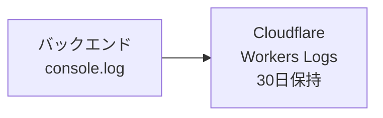
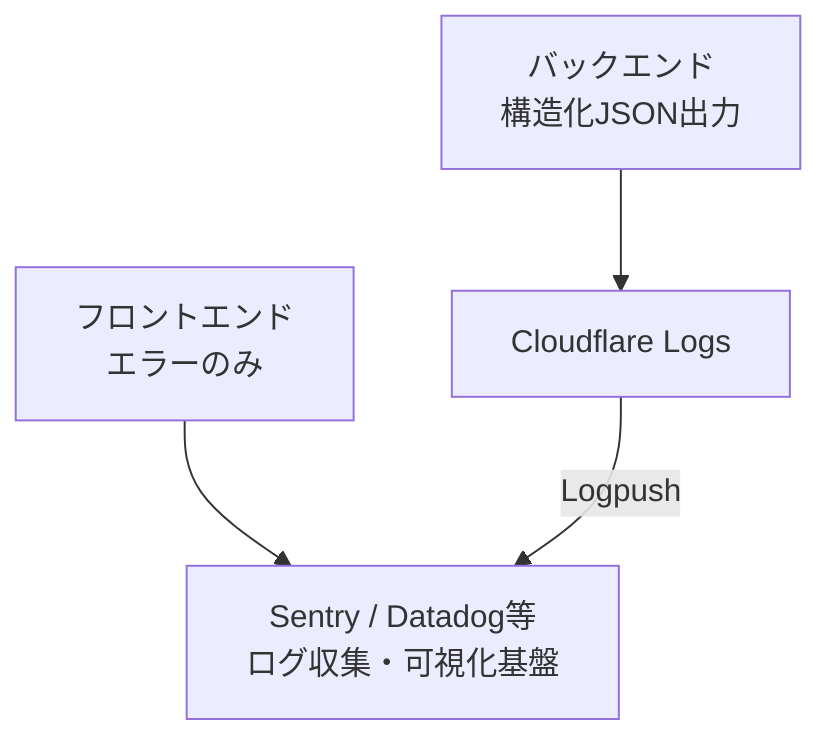

# セキュリティ設計

## サマリ

このドキュメントでは、認証/認可方式（Google OAuth/dev-login、JWT、RLS）、データ保護（通信暗号化、サーバー側保護）、脅威モデル/対策、監査ログ方針を定める。ローカルストレージ暗号化は非採用（セキュアな鍵保管手段がないため）。

## 変更履歴

| 日付 | 内容 | 意図 |
| --- | --- | --- |
| 20260113 | 初版作成 | - |

## 本文

### 認証/認可方式

#### 認証プロバイダー

`NODE_ENV`ではなく`APP_ENV`で制御する。`NODE_ENV`はNode.jsランタイム最適化に使用し、ステージング環境でも`NODE_ENV=production`となるため、認証制御には使用しない。

| 環境 | APP_ENV | dev-login | Google OAuth |
| --- | --- | --- | --- |
| 開発環境 | development | ✓ 利用可 | △ 利用可（GOOGLE_CLIENT_ID設定時のみ） |
| ステージング | staging | ✕ 利用不可 | ✓ 利用可 |
| 本番環境 | production | ✕ 利用不可 | ✓ 利用可 |

#### JWTトークン

**トークン保管・送信方式**

本アプリはPWA（Webブラウザ専用）であり、モバイルネイティブアプリは対象外のため、Cookie保管方式を採用する。

| 項目 | 仕様 |
| --- | --- |
| 保管場所 | HttpOnly Cookie |
| Cookie属性 | `HttpOnly`, `Secure`, `SameSite=Strict`, `Path=/api` |
| CSRF対策 | SameSite=Strictにより不要（クロスサイトリクエストでCookieが送信されない） |

**アクセストークン**

| 項目 | 仕様 |
| --- | --- |
| アルゴリズム | RS256（非対称鍵） |
| 有効期限 | 1時間 |
| ペイロード | `jti`（トークンID）, `sub`（ユーザーID）, `email`, `iat`, `exp`, `type: "access"` |
| 署名鍵 | 環境変数で管理、定期ローテーション（90日推奨） |

**リフレッシュトークン**

| 項目 | 仕様 |
| --- | --- |
| 有効期限 | 7日間 |
| ペイロード | `jti`（トークンID）, `sub`（ユーザーID）, `iat`, `exp`, `type: "refresh"` |
| ローテーション | リフレッシュ時に新トークン発行、旧トークンは即座に無効化 |

**jti（JWT ID）**

| 項目 | 仕様 |
| --- | --- |
| 形式 | UUID v4 |
| 生成タイミング | トークン発行時にサーバー側で生成 |
| 用途 | トークン識別 |

#### 認可(RLS)

**コネクションプール対策**

本アプリはNeon Serverless（HTTP経由）を使用するため、各リクエストは独立したトランザクションで処理される。ただし、将来的なアーキテクチャ変更に備え、以下の方針を採用する。

| 方式 | 説明 | 採用 |
| --- | --- | --- |
| `SET app.user_id = '...'` | セッション終了までグローバルに有効。コネクションプールで前ユーザーの値が残るリスク | ✕ |
| `SET LOCAL app.user_id = '...'` | 現在のトランザクション終了時に自動クリア | △ |
| `set_config('app.user_id', '...', true)` | 第3引数`true`でトランザクションローカル。関数形式でパラメータ化が容易 | **✓** |


Neon Serverless（HTTP経由）では、各リクエストが暗黙的に1トランザクションとして扱われるため、`set_config`と後続クエリは同一トランザクション内で実行される。

```typescript
// ミドルウェアでRLSユーザーを設定し、後続クエリと同一トランザクションで実行
app.use('/api/*', async (c, next) => {
  const userId = c.get('userId'); // JWT検証済みユーザーID（Cookieから取得）

  // Neon HTTP: 暗黙的トランザクション内で実行される
  await c.env.DB.execute(
    sql`SELECT set_config('app.user_id', ${userId}, true)`
  );
  return next();
});

// 明示的トランザクションが必要な場合（複数クエリの原子性が必要な場合）
app.post('/api/sync/push', async (c) => {
  const userId = c.get('userId');

  await c.env.DB.transaction(async (tx) => {
    // set_configとビジネスロジックを同一トランザクション内で実行
    await tx.execute(sql`SELECT set_config('app.user_id', ${userId}, true)`);
    await tx.execute(sql`INSERT INTO file_content_docs ...`);
    await tx.execute(sql`UPDATE projects ...`);
  });
});
```

**RLSポリシー**

※RLSポリシーの詳細については`データ設計.md`を参照

#### セッション管理

**セッションライフサイクル**

※認証フローのシーケンス図は`アーキテクチャ設計.md`を参照

**トークン失効時の挙動**

| 状態 | 挙動 |
| --- | --- |
| オンライン + アクセストークン期限切れ | リフレッシュトークンで自動更新 |
| オンライン + リフレッシュトークン期限切れ | ログイン画面へリダイレクト |
| オフライン + トークン期限切れ | 編集継続を許可、オンライン復帰時にログアウト処理 |

**トークン失効前の警告**

- トークン有効期限の24時間前に警告通知を表示
- 通知内容:「セッションがまもなく期限切れになります。データをエクスポートしてください」
- 通知にはZIPエクスポートへのリンクを含める
- オフライン状態でも、ローカルで有効期限を確認し警告を表示

### データ保護（暗号化/保管）

#### ローカルストレージの保護

ローカルストレージは**暗号化しない**。

**理由**

- Web環境ではセキュアな鍵保管手段がない
- sessionStorageに鍵を保存してもXSS攻撃で窃取可能
- パスフレーズ方式などでデバイス外に鍵を保管する場合、UXを著しく損なう（毎回入力が必要）

**代替策**

- オフラインデータは平文で保存
- XSS対策（CSP、React自動エスケープ）でローカルデータへのアクセスを防止
- 機密性の高いデータはサーバー側でのみ保持

#### 通信の保護

**HTTPS/TLS**

| 項目 | 仕様 |
| --- | --- |
| プロトコル | TLS 1.2以上（1.3推奨） |
| 証明書 | Let's Encrypt（自動更新） |
| HSTS | `max-age=31536000; includeSubDomains; preload` |

#### サーバー側のデータ保護

**データベース**

| 項目 | 仕様 |
| --- | --- |
| 接続 | SSL/TLS必須 |
| 認証 | 接続文字列（環境変数で管理） |
| データ暗号化 | Neonのat-rest encryption（AES-256） |
| バックアップ | Neonの自動バックアップ（7日間保持） |

**ファイルコンテンツ**

- **平文保存**: サーバー側ではファイルコンテンツを平文で保存
- **理由**: 将来的な検索機能、AI機能への対応を考慮
- **保護**: RLSによるアクセス制御、TLSによる通信暗号化で保護

#### 機密情報の管理

**環境変数**

シークレットはCloudflare Workers Secretsで管理する。

※環境変数一覧は`運用デプロイ設計.md`を参照

**シークレットローテーション**

| シークレット | ローテーション頻度 | 手順 |
| --- | --- | --- |
| JWT署名鍵 | 90日 | 新鍵で署名開始 → 旧鍵で検証継続（7日間） → 旧鍵削除 |
| DB接続文字列 | パスワード変更時 | Neonでパスワード変更 → 環境変数更新 → デプロイ |
| OAuth シークレット | 必要時 | Google Cloudで再生成 → 環境変数更新 → デプロイ |

### 脅威モデル/対策

#### 脅威と対策一覧

**認証・セッション関連**

| 脅威 | 影響 | 対策 |
| --- | --- | --- |
| ブルートフォース攻撃 | アカウント乗っ取り | レート制限（5回/分）、アカウントロック（10回失敗で30分） |
| セッションハイジャック | 不正アクセス | HTTPOnly Cookie、Secure属性、短いトークン有効期限 |
| トークン漏洩 | 不正アクセス | 短い有効期限（1時間）、リフレッシュ時のローテーション |
| CSRF | 不正操作 | Cookie属性`SameSite=Strict`により対策済み（CSRFトークン不要） |

**インジェクション攻撃**

| 脅威 | 影響 | 対策 |
| --- | --- | --- |
| SQLインジェクション | データ漏洩・改ざん | パラメータ化クエリ（Prepared Statement） |
| XSS | セッション窃取・改ざん | React自動エスケープ、CSP、dangerouslySetInnerHTML不使用 |
| コマンドインジェクション | サーバー侵害 | 該当機能なし（ファイルシステム操作なし） |

**データ保護関連**

| 脅威 | 影響 | 対策 |
| --- | --- | --- |
| ローカルストレージ覗き見 | データ漏洩 | XSS対策（CSP、React自動エスケープ）で防止 |
| 中間者攻撃 | データ傍受 | TLS 1.2以上、HSTS、証明書ピンニング検討 |

**アクセス制御関連**

| 脅威 | 影響 | 対策 |
| --- | --- | --- |
| 水平権限昇格 | 他ユーザーデータアクセス | RLS、API層でのユーザーID検証 |
| 垂直権限昇格 | 管理機能への不正アクセス | 管理機能は別システム（初期リリースでは対象外） |

**サービス妨害**

| 脅威 | 影響 | 対策 |
| --- | --- | --- |
| DoS攻撃 | サービス停止 | Cloudflareのレート制限・WAF |
| 大量データ送信 | リソース枯渇 | リクエストサイズ制限（10MB）、ファイルサイズ制限 |

#### 防御できる脅威/防御できない脅威

**現在の対策で防御できる脅威**

- 他オリジンからのアクセス（Same-Origin Policyによる保護）
- SQLインジェクション（Prepared Statementによる保護）
- CSRF（SameSite=Strict Cookieによる保護）
- 中間者攻撃（TLS/HSTSによる保護）

**現在の対策で防御できない脅威**

ローカルストレージを暗号化しない設計のため、XSS対策は特に重要。CSPの厳格化(将来的なnonce方式導入)、dangerouslySetInnerHTMLの使用禁止を徹底すること。

- XSS攻撃によるローカルストレージアクセス（暗号化していないため）
- 悪意のあるブラウザ拡張機能（ページコンテキストへのアクセスが可能）
- 端末への物理アクセス（開発者ツールでデータ取得可能）

#### 将来的なContent Security Policy (CSP) の厳格化

**初期リリース時のCSP**

Next.jsはビルド時にインラインスクリプトを生成するため、初期リリースでは`script-src`に`unsafe-inline`を許可する。`unsafe-inline`はスクリプト・スタイル両方に許可（初期リリースの暫定対応）し、`unsafe-eval`は禁止する。また、`script-src 'unsafe-inline'`はXSS攻撃のリスクを残すため、将来的にnonce方式へ移行する。

```
Content-Security-Policy:
  default-src 'self';
  script-src 'self' 'unsafe-inline';
  style-src 'self' 'unsafe-inline';
  img-src 'self' data: https:;
  font-src 'self' https://fonts.gstatic.com;
  connect-src 'self' https://*.example.com;
  frame-ancestors 'none';
  base-uri 'self';
  form-action 'self';
```

#### レート制限

| エンドポイント | 制限 | 超過時 |
| --- | --- | --- |
| `/api/auth/login` | 5回/分/IP | 429 + 60秒待機 |
| `/api/auth/signup` | 3回/分/IP | 429 + 60秒待機 |
| `/api/auth/refresh` | 10回/分/ユーザー | 429 |
| `/api/sync/push` | 60回/分/ユーザー | 429 |
| `/api/sync/pull` | 60回/分/ユーザー | 429 |
| その他API | 100回/分/ユーザー | 429 |

#### バリデーション

**フロントエンド/バックエンド共通**

- プロジェクト名/ファイル名/フォルダ名: 要件定義書に準拠
- UUID: v4形式、Nil UUID禁止
- JSON: スキーマ検証（Zod等）
- ファイルサイズ: 100KB以下（推奨）、1MB以下（上限）

**サニタイズ**

- ユーザー入力はエスケープ処理を適用
- HTMLタグは許可しない（マークダウンとして保存、表示時にレンダリング）
- SQLパラメータはPrepared Statementで処理

※バリデーションルールは`要件定義.md`を参照

### 監査ログ方針

#### 初期リリース時の構成

バックエンドAPIのみで構造化JSONをstdoutに出力し、Cloudflareダッシュボードで確認する。



- **フロントエンド**: ログ出力なし
- **バックエンド**: `console.log`/`console.error`で構造化JSON出力
- **確認方法**: Cloudflareダッシュボード → Workers → Logs

#### 将来構成（初期リリース対象外）

外部ログ収集基盤（Sentry、Datadog等）への集約は、要件定義に含まれていないため初期リリース対象外。将来的に以下の構成を検討する。



| 項目 | 内容 |
| --- | --- |
| フロントエンドエラー収集 | Sentry SDK導入、エラー境界でキャッチ |
| ログ集約 | Cloudflare Logpush → 外部SIEM連携 |
| アラート | エラー率閾値でSlack/PagerDuty通知 |
| ダッシュボード | Grafana等でメトリクス可視化 |

#### ログ対象イベント

**認証イベント**

| イベント | ログレベル | 記録内容 |
| --- | --- | --- |
| ログイン成功 | INFO | user_id, provider, IP, User-Agent |
| ログイン失敗 | WARN | email（ハッシュ）, 失敗理由, IP, User-Agent |
| ログアウト | INFO | user_id |
| トークンリフレッシュ | DEBUG | user_id |
| アカウントロック | WARN | user_id, ロック理由 |

**データ操作イベント**

| イベント | ログレベル | 記録内容 |
| --- | --- | --- |
| プロジェクト作成/削除 | INFO | user_id, project_id, operation |
| 同期操作（push/pull） | DEBUG | user_id, project_id, operation, result |
| 競合発生 | WARN | user_id, project_id, conflict_type |

**セキュリティイベント**

| イベント | ログレベル | 記録内容 |
| --- | --- | --- |
| 認可エラー（RLS違反） | WARN | user_id, attempted_resource, operation |
| レート制限超過 | WARN | user_id/IP, endpoint, count |
| 不正なトークン | WARN | IP, User-Agent, エラー詳細 |
| CSP違反 | ERROR | 違反内容（report-uri経由） |

#### ログ形式

```json
{
  "timestamp": "2024-01-15T09:30:00.000Z",
  "level": "INFO",
  "event": "auth.login.success",
  "user_id": "uuid",
  "ip": "203.0.113.1",
  "user_agent": "Mozilla/5.0...",
  "request_id": "uuid",
  "metadata": {
    "provider": "google"
  }
}
```

#### PII（個人識別情報）の取り扱い

| 情報 | 取り扱い |
| --- | --- |
| ユーザーID | 記録する（識別に必要） |
| メールアドレス | ログイン失敗時のみハッシュ化して記録 |
| IPアドレス | 記録する（不正アクセス調査に必要） |
| ファイルコンテンツ | 記録しない |

#### ログ保持期間

**初期リリース時**

| ログ種別 | 保持期間 | 保管場所 |
| --- | --- | --- |
| 全ログ | 30日 | Cloudflare Workers Logs |

**将来構成（外部SIEM導入後）**

| ログ種別 | 保持期間 | 保管場所 |
| --- | --- | --- |
| アプリケーションログ | 30日 | Cloudflare Logs + 外部SIEM |
| セキュリティイベント | 90日 | 外部SIEM |
| 監査ログ（認証） | 1年 | 外部SIEM |

### セキュリティテスト項目

※`テスト設計.md`を参照
